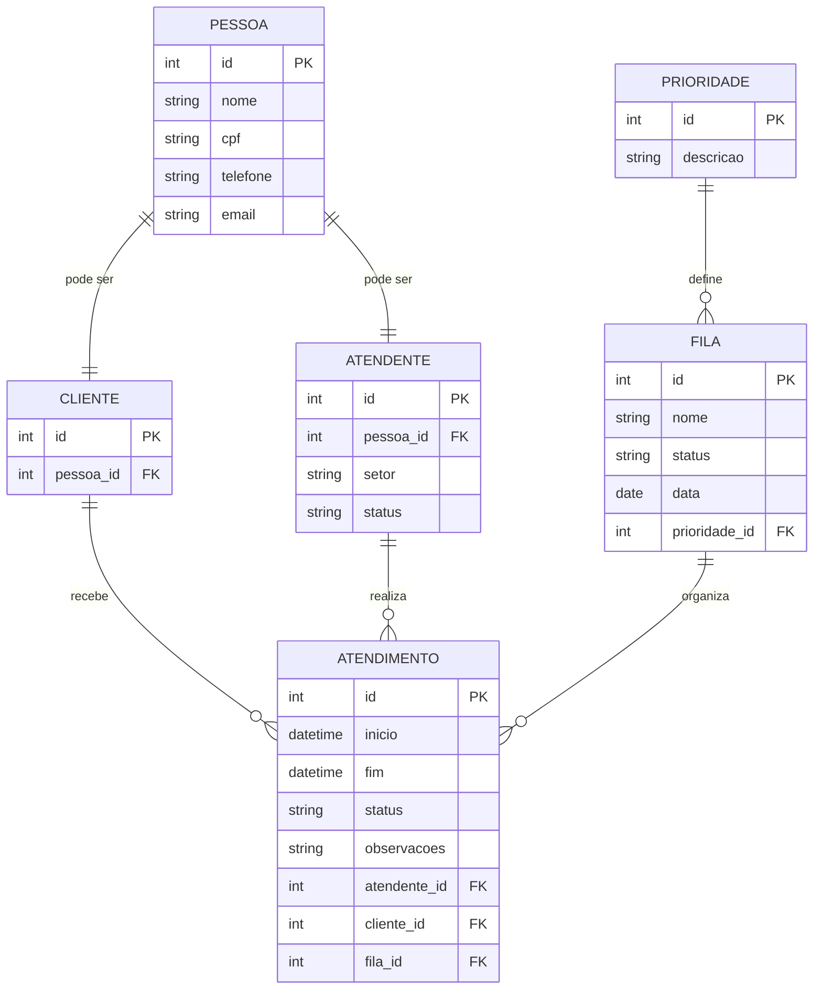

**Modelagem de Banco de Dados com PostgreSQL - Atividade**

## 📖 Apresentação do Projeto

O  Sistema de Registro de Atendimento  é um aplicativo desenvolvido para auxiliar empresas no controle de filas e no gerenciamento de atendimentos realizados diariamente. A aplicação permite organizar o fluxo de clientes, registrar atendentes, acompanhar o tempo de atendimento e manter um histórico completo das interações realizadas.

O principal objetivo do sistema é otimizar o processo de atendimento, reduzir falhas no controle manual e fornecer maior organização e eficiência operacional. Além disso, a ferramenta possibilita melhor acompanhamento administrativo, permitindo análise de desempenho e melhoria contínua dos serviços prestados.

## Estrutura Inicial do Projeto
Nesta etapa, o projeto contempla apenas a modelagem inicial do banco de dados, com:

- Definição das principais tabelas
- Estabelecimento dos relacionamentos entre entidades
- Sem aprofundamento em regras de negócio ou funcionalidades do sistema

## Modelo de Dados
O modelo de dados foi desenvolvido utilizando diagrama ER em formato MERMAID, representando:

- Entidades principais do sistema: PESSOA, CLIENTE, ATENDENTE, FILA, PRIORIDADE e ATENDIMENTO
- Relacionamentos entre as entidades
- Estrutura inicial pronta para expansão futura

