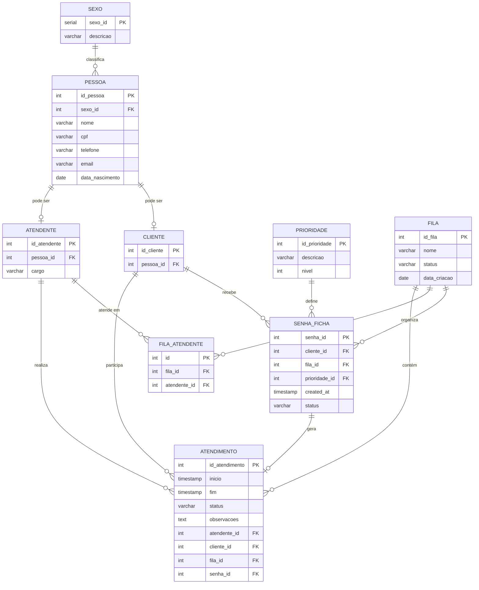

**Modelagem de Banco de Dados com PostgreSQL - Atividade**

## 📖 Apresentação do Projeto

O  Sistema de Registro de Atendimento  é um sitema dedicado a entidades bancárias para o controle de filas e no gerenciamento de atendimentos realizados diariamente. A aplicação permite organizar o fluxo de clientes, registrar atendentes, acompanhar o tempo de atendimento e manter um histórico completo das interações realizadas.

O principal objetivo do sistema é otimizar o processo de atendimento, reduzir falhas no controle manual e fornecer maior organização e eficiência operacional. Além disso, a ferramenta possibilita melhor acompanhamento administrativo, permitindo análise de desempenho e melhoria contínua dos serviços prestados.

## Estrutura do Projeto
Nesta etapa, o projeto contempla a modelagem do banco de dados, com:

        1. Visão Geral — propósito do sistema e fluxo principal
        2. Entidades — tabela com as 9 entidades, finalidade e atributos
        3. Relacionamentos — tabela com cardinalidades e descrições
        4. Regras de Negócio — as 6 regras implementadas no modelo
        5. Fluxo Operacional — passo a passo do uso do sistema
        6. Observações Técnicas — detalhes de implementação do banco

## Modelo de Dados
O modelo de dados foi desenvolvido utilizando diagrama ER em formato MERMAID, representando:

- Entidades principais do sistema: PESSOA, SEXO, CLIENTE, ATENDENTE, ATENDENTE FILA, FILA, PRIORIDADE, SENHA/FICHA e ATENDIMENTO
- Relacionamentos entre as entidades

## Regra de Negócio
        1. Pessoa universal — Clientes e atendentes são cadastrados primeiro como PESSOA, evitando duplicidade de dados pessoais.
        2. Duplo papel — Uma mesma pessoa pode ser simultaneamente cliente e atendente, com registros independentes em cada tabela especializada.
        3. Gestão de filas — Cada fila pode ter múltiplos atendentes associados via FILA_ATENDENTE, permitindo escalabilidade e cobertura.
        4. Rastreabilidade — O ATENDIMENTO referencia a SENHA_FICHA de origem, criando trilha completa: cliente → fila → ficha → atendimento.
        5. Prioridade na ficha — A prioridade é definida no momento da emissão da senha, não no atendimento, refletindo corretamente o fluxo real.
        6. Controle de status — Tanto FILA quanto SENHA_FICHA possuem campo status, permitindo controle de estados (aberta/fechada/aguardando/atendida).

## Fluxograma do Sistema
```
Cliente chega à agencia bancaria e se dirige ao recepcionista
        ↓
Recepcionista realiza retirada de ficha/senha para o cliente
        ↓
Recepcionista analisa se o cliente tem auguma condição prioritária:
    Se Não                                Se Sim:
        ↓                                      ↓
Cliente é inserido em fila Comum     Cliente é inserido em fila prioritária
        ↓                                      ↓
Cliente é atendido por algum especialista   ← ←
(Assistente comercial, Gerente juridico etc..)
        ↓
Atendimento registrado e concluído
        ↓
Atendimento é encerrado
```


```mermaid
erDiagram
    SEXO {
        serial sexo_id PK
        varchar descricao
    }

    PESSOA {
        int id_pessoa PK
        int sexo_id FK
        varchar nome
        varchar cpf
        varchar telefone
        varchar email
        date data_nascimento
    }

    CLIENTE {
        int id_cliente PK
        int pessoa_id FK
    }

    ATENDENTE {
        int id_atendente PK
        int pessoa_id FK
        varchar cargo
    }

    PRIORIDADE {
        int id_prioridade PK
        varchar descricao
        int nivel
    }

    FILA {
        int id_fila PK
        varchar nome
        varchar status
        date data_criacao
    }

    FILA_ATENDENTE {
        int id PK
        int fila_id FK
        int atendente_id FK
    }

    SENHA_FICHA {
        int senha_id PK
        int cliente_id FK
        int fila_id FK
        int prioridade_id FK
        timestamp created_at
        varchar status
    }

    ATENDIMENTO {
        int id_atendimento PK
        timestamp inicio
        timestamp fim
        varchar status
        text observacoes
        int atendente_id FK
        int cliente_id FK
        int fila_id FK
        int senha_id FK
    }

    SEXO ||--o{ PESSOA : "classifica"
    PESSOA ||--o| CLIENTE : "pode ser"
    PESSOA ||--o| ATENDENTE : "pode ser"

    CLIENTE ||--o{ SENHA_FICHA : "recebe"
    FILA ||--o{ SENHA_FICHA : "organiza"
    PRIORIDADE ||--o{ SENHA_FICHA : "define"

    FILA ||--o{ FILA_ATENDENTE : "possui"
    ATENDENTE ||--o{ FILA_ATENDENTE : "atende em"

    SENHA_FICHA ||--o| ATENDIMENTO : "gera"
    ATENDENTE ||--o{ ATENDIMENTO : "realiza"
    CLIENTE ||--o{ ATENDIMENTO : "participa"
    FILA ||--o{ ATENDIMENTO : "contém"
```

## Versão
| Versão | Description |
| --- | --- |
| 1.1| Estrutura que comtempla Entidades sistema: PESSOA, CLIENTE, ATENDENTE, FILA, PRIORIDADE e ATENDIMENTO  |
| 1.2| Adição do fluxograma exemplificando como irá funcionar o sistema |
| 1.3| Adição de esquema de versionamento do projeto|
| 1.4| Alteração do diagrama MERMAID com alguns incrementos|
| 1.5| Adição de novas tabelas e comportamentos entre elas, prioridade definida dentro de senha|
